# Develop a Web Application to add 2 numbers

# Requirements
Java (JDK 8+)
Eclipse IDE 2018 / Visual Studio Code / Terminal
Apache Maven 3.6.0 
Apache Tomcat 9
MYSQL 8.0.13
Git
GitHub

# Getting Started

1. Eclipse IDE 2018
Download the project and extract folder
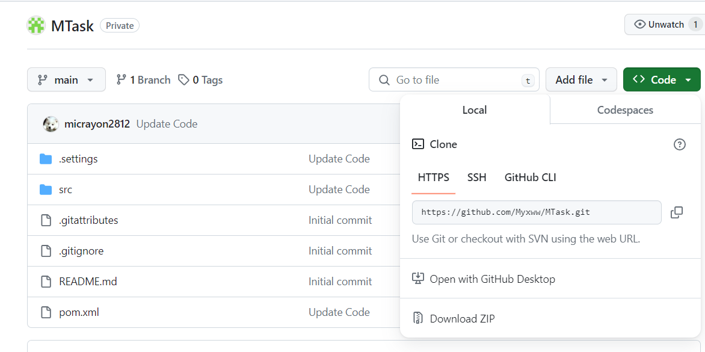

Open Eclipse and set the Workspace path
Import Projects from File System

Severs -> New Server 
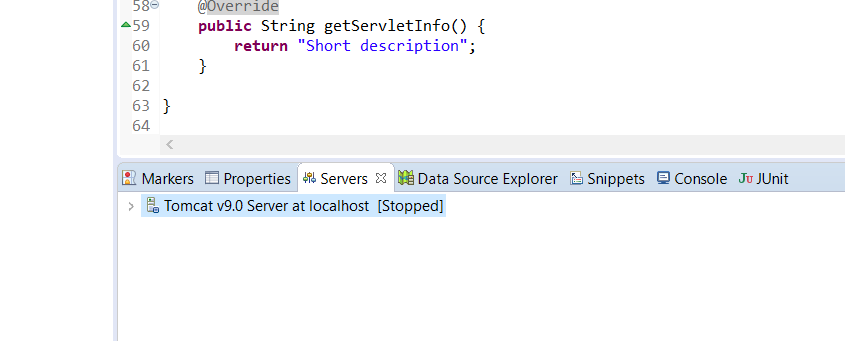

Select Tomcat v9 Server
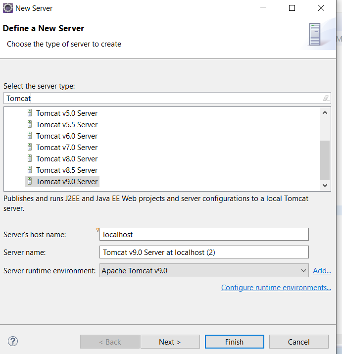

Edit your path to Tomcat
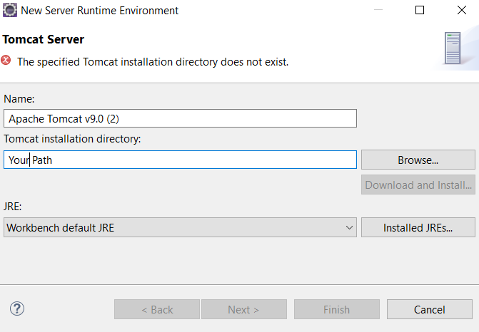

Select -> Add All -> Finish
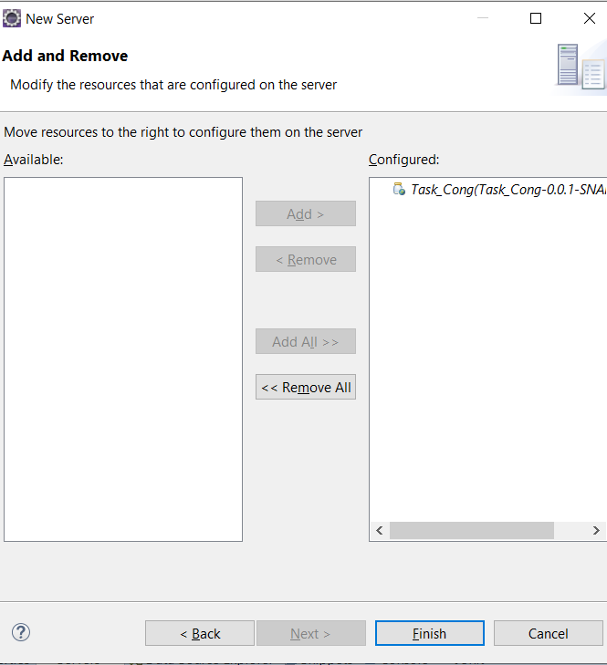

Select the application -> Run As -> Run on Server -> Select an Server -> Finish
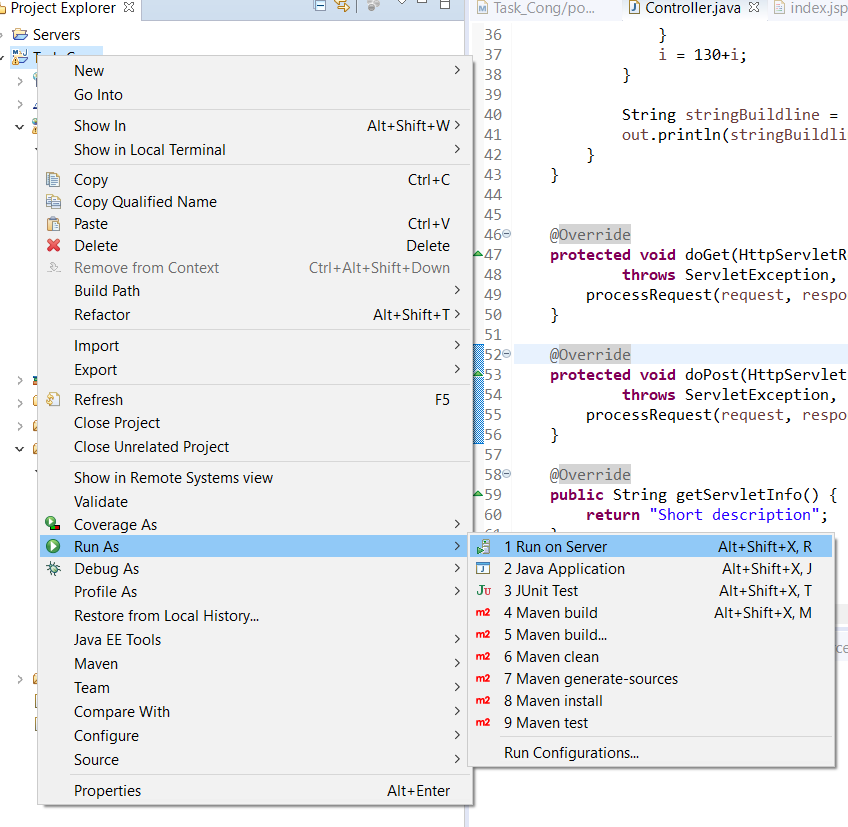
The application start on port 8080

# 1.1 Test
Test case
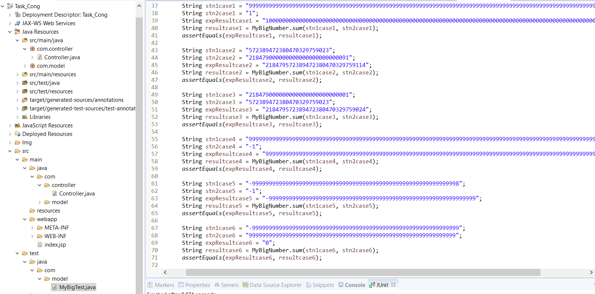

Select the application -> Run As -> JUnit Test
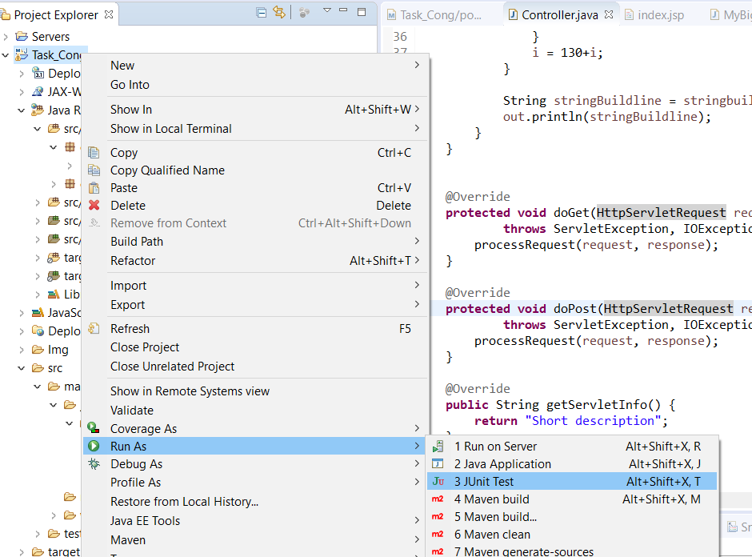

Test
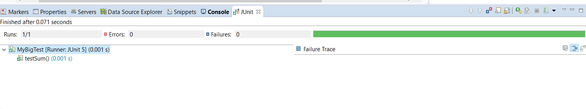

2. Visual Studio Code / Terminal
git clone https://github.com/Myxww/MTask.git
cd MTask
mvn --version
mvn clean package

The application start on port 8080

# Result
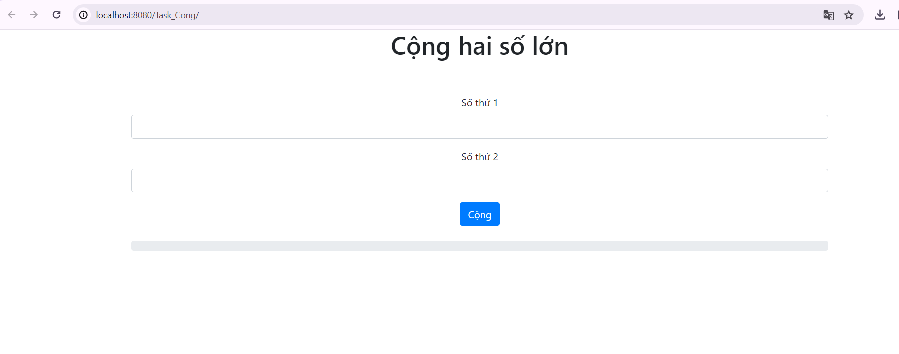

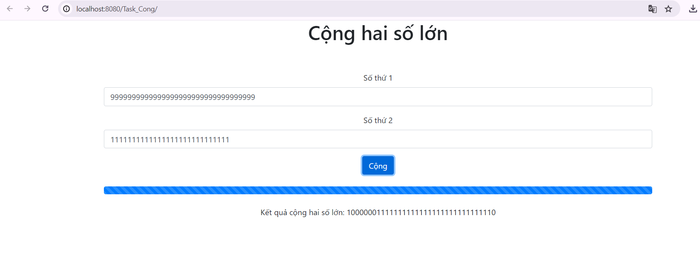

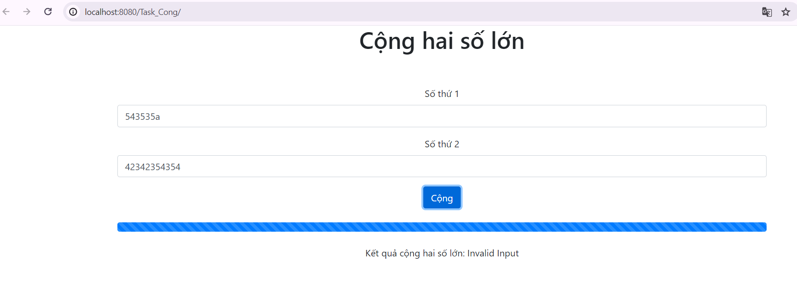

